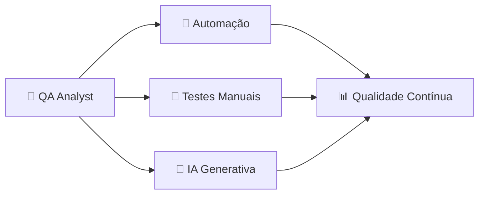
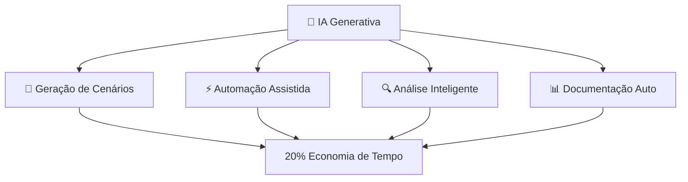

<div align="center">

# 🚀 Uriel Sampaio

### Analista de Qualidade de Software com foco em testes manuais e automatizados.

[](https://www.linkedin.com/in/uriel-sampaio-728184356/)
[](https://github.com/urielqa)
[](mailto:urielsqa@gmail.com)
[](https://wa.me/5511947013629)

---

📍 **Itapevi - SP** | 🎯 **Foco em Testes Manuais e Automatizados | Qualidade e Eficiência**

</div>

---

## 👨‍💻 Sobre Mim

Sou **Analista de Qualidade de Software** apaixonado por tecnologia desde os 14 anos. Tenho experiência em **testes manuais e automatizados**, participando ativamente do ciclo de desenvolvimento (SDLC).
Meu objetivo é ajudar a garantir a **qualidade e confiabilidade de produtos digitais** através de testes eficientes e colaboração com a equipe.

> **💡 Meu diferencial**: Entusiasmo por aprender e contribuir com soluções práticas para melhorar a experiência do usuário.

Tenho conhecimento em **Cypress**, **Playwright**, **Selenium** e **BDD (Cucumber)**, além de **testes de API (Postman)** e **integração contínua (GitHub Actions)**.
Busco sempre melhorar meus processos e aprender com cada projeto.

---

## 🔄 Meu Fluxo de Qualidade

<div align="center">



</div>

---

## 🎯 Principais Competências

<div align="center">

| 🔧 **Automação** | 🧪 **Testes** | 🚀 **DevOps** | 🤖 **IA** |
|------------------|---------------|---------------|-----------|
| ✅ E2E, Regressão | ✅ Exploratório, Smoke | ✅ CI/CD, Docker | ✅ LLMs, Cenários |
| ✅ BDD & Gherkin | ✅ API Testing | ✅ GitHub Actions | ✅ Scripts IA |
| ✅ Cypress, Playwright | ✅ Postman | ✅ Jenkins | ✅ Documentação |

</div>

---

## 🎯 Minha Missão como QA

<div align="center">

```diff
+ 🎯 MISSÃO: Garantir qualidade e funcionalidade para o usuário final
+ ⚡ FOCO: Eficiência técnica + Impacto positivo no cliente
+ 🚀 APLICAÇÃO: Colaboração + Melhoria contínua
```

> *"Minha missão como QA é ajudar a garantir que o sistema funcione bem e seja confiável para o usuário final. Busco equilibrar eficiência e impacto, colaborando com a equipe para melhorar continuamente."*

</div>

---

## 🛠️ Habilidades Técnicas

| **Categoria** | **Habilidades** |
|---------------|-----------------|
| **🔧 Automação & Frameworks** | Cypress, Playwright, Selenium, Cucumber (Gherkin), TestNG, JUnit |
| **💻 Linguagens** | JavaScript, TypeScript, HTML5, CSS3, SQL, Python |
| **🧩 APIs & Backend** | REST, Postman, Swagger, Node.js |
| **🗄️ Banco de Dados** | MySQL, PostgreSQL, MongoDB |
| **🚀 CI/CD & DevOps** | Git, GitHub Actions, Jenkins, Docker |
| **📋 Gestão & Versionamento** | Jira, TestRail, Git Flow |
| **⚙️ Ferramentas de Desenvolvimento** | VS Code, Eclipse, IntelliJ IDEA, npm |

---

## 🎯 Principais Stacks

<p align="left">
  
  
  
  
  
  
  
  
  
  
  
</p>

---

## 🏆 Principais Conquistas

<div align="center">

| 🥇 **Conquista** | 📊 **Métrica** | 💡 **Impacto** |
|------------------|---------------|----------------|
| 🚀 **Testes Automatizados** | `20%` redução | Tempo de testes otimizado |
| 🎯 **BDD em Projetos** | `Melhoria` clareza | Comunicação na equipe |
| ⚙️ **Pipeline CI/CD** | `Execução` automática | Feedback rápido |
| 🌐 **Multiplataforma** | `2` ambientes | Cobertura básica |
| 🤖 **IA em QA** | `Exploração` inicial | Automação simples |

</div>

---

## 🚀 Projetos em Destaque

<div align="center">

| 🎯 **Projeto** | 🛠️ **Stack** | 🚀 **Destaque** |
|----------------|--------------|-----------------|
| [**💼 E2E Code Brokers**](https://github.com/urielqa/E2E-Code-Brokers) | `HTML5` `CSS3` `JS` `TradingView` | Plataforma de trading com validações |
| [**🛒 E2E Shop**](https://github.com/urielqa/E2EShop) | `HTML` `CSS` `JavaScript` | E-commerce simples |
| [**🚀 QA Automation Portfolio**](https://github.com/urielqa/qa-automation-portfolio) | `Cypress` `Playwright` `API` `CI/CD` | Portfolio com automação |
| [**📋 Casos de Teste Manuais**](https://github.com/urielqa/Casos-de-teste-manuais) | `Gherkin` `BDD` `Checklist` | Documentação de testes |

### 🔧 **Projetos Complementares**

| 🎯 **Projeto** | 🛠️ **Stack** | 🚀 **Foco** |
|----------------|--------------|-------------|
| [**🔧 Automação de Testes**](https://github.com/urielqa/Automacao-de-testes) | `Selenium` `JUnit` `Java` | Exemplos de automação |

</div>

### 🔥 **Highlights dos Projetos**

```diff
+ 💼 E2E Code Brokers: Trading platform com validações básicas
+ 🛒 E2E Shop: E-commerce desenvolvido com foco em testes
+ 🚀 QA Portfolio: Portfolio com Cypress, Playwright e API
+ 📋 Casos Manuais: Gherkin e BDD para testes
+ 🔧 Automação Java: Exemplos com Selenium
```

---

## 🧠 Experiência com IA Generativa

<div align="center">



</div>

| 🎯 **Aplicação** | 📊 **Métrica** | 🚀 **Resultado** |
|------------------|---------------|------------------|
| **📝 Geração de Cenários** | `20%` economia | Scripts básicos |
| **⚡ Automação Assistida** | `LLMs` integrados | Cypress + Playwright |
| **🔍 Análise Inteligente** | `Copilot` ativo | Identificação de falhas |
| **📊 Documentação Auto** | `Cobertura` inicial | Processos simples |

---

## 🎓 Formação

- 🎓 **E2E Treinamentos** – Desenvolvimento e Qualidade de Software *(2025–2026)*
- 🎓 **UNIP** – Gestão da Tecnologia da Informação *(2018–2020)*
- 🎓 **UNIBES** – Web Design *(2015)*

---

## 🧩 Soft Skills

| 💬 Comunicação | 👑 Visão de Dono | ⚡ Proatividade |
|----------------|----------------|----------------|
| Clareza na equipe | Propõe melhorias | Atua de forma ativa |
| 🤝 Colaboração | 🔧 Resolução de Problemas | 🚀 Inovação |
| Trabalha em squads | Abordagem analítica | Busca aprender |

---

## 📈 Estatísticas do GitHub

<div align="center">


</div>

---

## 🎯 Objetivos Profissionais

- 🚀 Aprender mais sobre **automação e qualidade**
- 🤖 Explorar **IA Generativa** em QA
- 🧩 Contribuir com **projetos open-source**
- 🧪 Melhorar em **testes ágeis**

---

## 📞 Vamos Conectar?

<div align="center">

```diff
+ 🚀 Pronto para aprender e colaborar!
+ 💡 Vamos discutir testes e automação
+ 🤝 Conecte-se e vamos crescer juntos
```

[](https://www.linkedin.com/in/uriel-sampaio-728184356/)
[](mailto:urielsqa@gmail.com)
[](https://wa.me/5511947013629)

---

**📧 Email**: `urielsqa@gmail.com`
**📱 WhatsApp**: `+55 11 94701-3629`
**📍 Localização**: `Itapevi - SP, Brasil`

---

### ⭐ "Qualidade é importante — vamos trabalhar juntos para alcançá-la." ⭐

<div align="center">

**Feito com ❤️ por [Uriel Sampaio](https://github.com/urielqa)**


</div>

