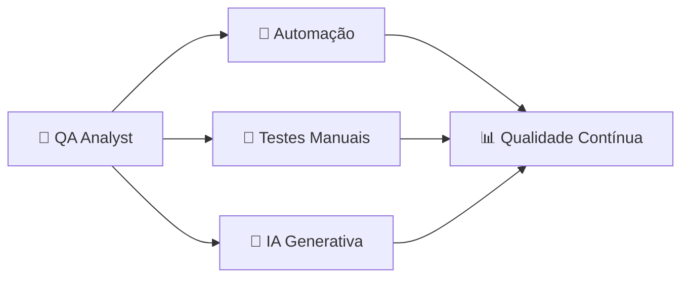
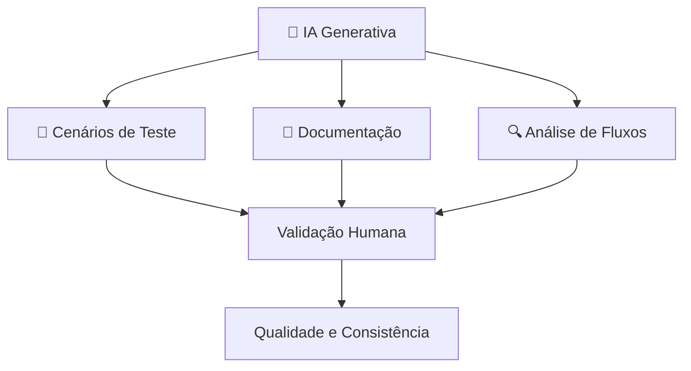

<div align="center">

# 🚀 Uriel Sampaio

### Analista de QA | Automação Mobile, Web e API | CI/CD

[](https://www.linkedin.com/in/uriel-sampaio-728184356/)
[](https://github.com/urielqa)
[](mailto:urielsqa@gmail.com)
[](https://wa.me/5511947013629)

---

📍 **Jandira - SP** | 🎯 **QA Pleno · Mobile · Web · API · CI/CD**

</div>

---

## 👨‍💻 Sobre Mim

Sou **Analista de Qualidade de Software** com cerca de 4 anos de experiência atuando em testes manuais e automatizados para aplicações **Mobile (Android e iOS)**, **Web** e **APIs**.

Atuo ao longo de todo o ciclo de desenvolvimento de software (SDLC), com forte mentalidade **shift-left**, colaborando desde o refinamento de requisitos até a validação final das entregas, sempre com foco em prevenção de falhas, estabilidade e confiabilidade das releases.

Possuo experiência prática em automação de testes mobile com **Appium** e **CodeceptJS**, testes web com **Cypress** e **Playwright**, e validação de APIs REST com **Postman** e **Swagger**, integrando testes automatizados a pipelines de CI/CD com **Azure Pipelines** e **GitHub Actions**.

Trabalho de forma próxima a times de desenvolvimento e produto, contribuindo para decisões técnicas, melhoria contínua da qualidade e melhor experiência para o usuário final.

---

## 🔄 Meu Fluxo de Qualidade

<div align="center">


```mermaid
graph LR
    A[🎯 QA Analyst] --> B[🔧 Automação]
    A --> C[🧪 Testes Manuais]
    A --> D[🤖 IA Generativa]
    B --> E[📊 Qualidade Contínua]
    C --> E
    D --> E
```

</div>

---

## 🎯 Foco de atuação

<div align="center">

| 🔧 **Automação** | 🧪 **Testes** | 🚀 **CI/CD & Ferramentas** | 📱 **Escopo** |
|------------------|---------------|----------------------------|---------------|
| E2E, Regressão | Exploratório, Smoke, API | Azure Pipelines, GitHub Actions | Mobile, Web, API |
| Appium, CodeceptJS | Postman, Swagger | LambdaTest, Bitbucket, GitHub | Android, iOS |
| Cypress, Playwright | Validação REST | Jira, Testomatio | Shift-left, SDLC |

```diff
+ Garantir qualidade e confiabilidade das entregas para o usuário final
+ Atuar em automação, testes manuais e validação de APIs com foco em prevenção de falhas
+ Colaborar com dev e produto na definição de critérios e na estabilidade das releases
```

</div>

---

## 🛠️ Hard Skills

### Uso profissional em produção

| **Categoria** | **Habilidades** |
|---------------|-----------------|
| **🔧 Automação** | Appium, CodeceptJS, Cypress, Playwright |
| **🧩 APIs** | Postman, Swagger (REST) |
| **🚀 CI/CD** | Azure Pipelines, GitHub Actions |
| **☁️ Testes & Gestão** | LambdaTest, Bitbucket, GitHub, Jira, Testomatio |
| **💻 Linguagens & Runtime** | JavaScript, TypeScript, Node.js |
| **⚙️ Ferramentas** | Android Studio, VS Code, Cursor |

### Em evolução contínua

- Estratégias avançadas de automação e desenho de frameworks
- Melhoria contínua de stacks de automação (Mobile, Web, API)
- Uso de IA generativa aplicada a QA (cenários, documentação e análise), com validação humana

---

## 🎯 Principais Stacks

<p align="left">
  
  
  
  
  
  
  
  
  
  
  
</p>

---

## 🏆 Principais Conquistas

<div align="center">

| 🥇 **Área** | 📊 **Atuação** | 💡 **Impacto** |
|-------------|----------------|----------------|
| **Automação E2E** | Regressão e smoke em Web e Mobile | Redução de tempo de validação e feedback contínuo |
| **CI/CD** | Pipelines em Azure Pipelines e GitHub Actions | Execução automática e entrega mais previsível |
| **Cobertura multiplataforma** | Android, iOS, Web e API | Validação consistente em todos os canais |
| **Colaboração** | Refinamento, critérios de aceite e qualidade | Menos retrabalho e releases mais estáveis |

</div>

---

## 🚀 Projetos em Destaque

<div align="center">

| 🎯 **Projeto** | 🛠️ **Stack** | 🚀 **Destaque** |
|----------------|--------------|-----------------|
| [**💼 E2E Code Brokers**](https://github.com/urielqa/E2E-Code-Brokers) | `HTML5` `CSS3` `JS` `TradingView` | Automação E2E em plataforma de trading; validação de fluxos e integração com gráficos |
| [**🛒 E2E Shop**](https://github.com/urielqa/E2EShop) | `HTML` `CSS` `JavaScript` | Suite E2E em e-commerce; cenários de navegação, carrinho e checkout |
| [**🚀 QA Automation Portfolio**](https://github.com/urielqa/qa-automation-portfolio) | `Cypress` `Playwright` `API` `CI/CD` | Framework de automação Web e API com integração a pipeline; Page Object e boas práticas |
| [**📋 Casos de Teste Manuais**](https://github.com/urielqa/Casos-de-teste-manuais) | `Gherkin` `BDD` `Checklist` | Especificação de cenários em BDD; documentação reutilizável para execução manual e automação |

### 🔧 **Projetos Complementares**

| 🎯 **Projeto** | 🛠️ **Stack** | 🚀 **Foco** |
|----------------|--------------|-------------|
| [**🔧 Automação de Testes**](https://github.com/urielqa/Automacao-de-testes) | `Selenium` `JUnit` `Java` | Automação Web com Selenium; estrutura de testes e relatórios |

</div>

### 🔥 **Highlights dos Projetos**

```diff
+ 💼 E2E Code Brokers: Automação E2E em plataforma de trading com validação de fluxos
+ 🛒 E2E Shop: Suite E2E para e-commerce (navegação, carrinho, checkout)
+ 🚀 QA Portfolio: Automação Web/API com Cypress e Playwright integrada a CI/CD
+ 📋 Casos Manuais: Cenários BDD e documentação para testes manuais e automação
+ 🔧 Automação Java: Projeto Selenium + JUnit com foco em estrutura e relatórios
```

---

## 🧠 Experiência com IA Generativa

<div align="center">


```mermaid
graph TD
    A[🤖 IA Generativa] --> B[📝 Cenários de Teste]
    A --> C[📄 Documentação]
    A --> D[🔍 Análise de Fluxos]
    B --> E[Validação Humana]
    C --> E
    D --> E
    E --> F[Qualidade e Consistência]
```

</div>

Uso de **IA generativa** como apoio ao trabalho de QA, com **validação humana** em todas as etapas:

| 🎯 **Aplicação** | 📋 **Uso** |
|------------------|------------|
| **Cenários de teste** | Geração de ideias e esboços de casos; revisão e refinamento manual |
| **Documentação** | Apoio na redação e organização de procedimentos e critérios de aceite |
| **Análise de fluxos** | Suporte na leitura de requisitos e identificação de cenários críticos |

As decisões de qualidade e a aprovação dos artefatos permanecem sob responsabilidade do QA.

---

## 🎓 Formação

- 🎓 **E2E Treinamentos** – Desenvolvimento e Qualidade de Software *(2025–2026)*
- 🎓 **UNIP** – Gestão da Tecnologia da Informação *(2018–2020)*
- 🎓 **UNIBES** – Web Design *(2015)*

---

## 🧩 Soft Skills

| 💬 Comunicação | 👑 Visão de Dono | ⚡ Proatividade |
|----------------|------------------|-----------------|
| Clareza com time e stakeholders | Propõe melhorias de processo e qualidade | Atuação antecipada em riscos e entregas |
| 🤝 Colaboração | 🔧 Resolução de Problemas | 🚀 Melhoria Contínua |
| Trabalho em squads multidisciplinares | Análise de causa raiz e mitigação | Evolução de práticas e ferramentas de QA |

---

## 📈 Estatísticas do GitHub

<div align="center">

[](https://github.com/urielqa)

[](https://github.com/urielqa)

*As imagens são geradas por [github-readme-stats](https://github.com/anuraghazra/github-readme-stats). Se não carregarem, atualize a página ou acesse o perfil em alguns instantes.*

</div>

---

## 🎯 Objetivos Profissionais

- Consolidar e evoluir **automação** em Mobile (Android/iOS), Web e API em ambientes de produção
- Aprofundar **qualidade em contextos ágeis**: critérios de aceite, refinamento e entrega contínua
- Fortalecer **CI/CD** e integração de testes em pipelines para feedback rápido e releases estáveis
- Contribuir para **experiência do usuário** por meio de testes funcionais, regressão e validação de fluxos críticos

---

## 📞 Contato

<div align="center">

```diff
+ Disponível para oportunidades em QA (Mobile, Web, API e CI/CD)
+ Interesse em projetos que valorizem automação e qualidade contínua
```

[](https://www.linkedin.com/in/uriel-sampaio-728184356/)
[](mailto:urielsqa@gmail.com)
[](https://wa.me/5511947013629)

---

**📧 Email**: `urielsqa@gmail.com`
**📱 WhatsApp**: `+55 11 94701-3629`
**📍 Localização**: `Itapevi - SP, Brasil`

---

### ⭐ "Qualidade é importante — vamos trabalhar juntos para alcançá-la." ⭐

<div align="center">

**Feito com ❤️ por [Uriel Sampaio](https://github.com/urielqa)**


</div>

