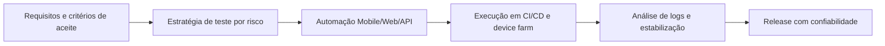

# Uriel Sampaio

### QA Automation Engineer | Mobile, Web, API | CI/CD

`Jandira - SP, Brasil` • `+4 anos em QA` • `Disponível para desafios em Quality Engineering`

---

## Engenharia de qualidade com ownership

Atuo como **QA Automation Engineer** com mais de **4 anos** em produtos digitais, garantindo qualidade de aplicações **Mobile (Android/iOS)**, **Web** e **APIs** em times ágeis.

Hoje atuo como **QA único no squad**, conduzindo a estratégia ponta a ponta:

- análise de requisitos e mapeamento de risco
- estratégia de testes por impacto de negócio
- automação e testes manuais em fluxos críticos
- validação final para release com foco em confiabilidade

Trabalho em parceria com **Devs, Product Owner e Scrum Master**, aplicando **Shift-Left** para reduzir risco e aumentar previsibilidade de entrega.

---

## Tech stack de alto impacto

### Frameworks e ferramentas principais

  
  
  
  
  
  
  
  
  
  
  
  

`Appium` `CodeceptJS` `BDD (Gherkin)` `POM` `Playwright` `Cypress` `Postman` `Swagger` `LambdaTest` `GitHub Actions` `Azure Pipelines` `Jira` `Testomatio`

---

## Como eu trabalho no ciclo de qualidade

```mermaid
flowchart LR
    A[Requisitos e critérios de aceite] --> B[Estratégia de teste por risco]
    B --> C[Automação Mobile/Web/API]
    C --> D[Execução em CI/CD e device farm]
    D --> E[Análise de logs e estabilização]
    E --> F[Release com confiabilidade]
```

- **Automação mobile cross-platform:** Appium + CodeceptJS com BDD e POM, tratando particularidades de Android e iOS — cobrindo mais de 300 cenários automatizados nos fluxos críticos de negócio.
- **Confiabilidade em pipeline:** investigação de falhas por logs, redução de flaky tests e ajustes após novas versões do app, reduzindo significativamente defeitos escapados para produção.
- **Validação crítica antes da produção:** testes manuais em homologação para garantir segurança de release.
- **Qualidade orientada a risco:** contribuição ativa em refinamentos e definição de critérios de aceite desde o início do desenvolvimento.

---

## Destaques profissionais

| Área | Atuação | Impacto |
|------|---------|---------|
| QA Strategy | QA único no squad com ownership completo | Decisões de qualidade mais rápidas e menor retrabalho por sprint |
| Mobile Automation | Framework Appium + CodeceptJS com BDD/POM | 300+ cenários automatizados cobrindo fluxos críticos em Android e iOS |
| CI/CD Reliability | Diagnóstico e estabilização de suítes | Redução significativa de bugs escapados para produção |
| Shift-Left | Qualidade desde os requisitos | Riscos identificados antes do desenvolvimento, não após |
| Device Farm | Execução em LambdaTest multi-device | Cobertura em múltiplos dispositivos, versões e resoluções Android/iOS |

---

## Projetos em destaque

| Projeto | Stack | Diferencial |
|--------|-------|-------------|
| [E2E Code Brokers](https://github.com/urielqa/E2E-Code-Brokers) | HTML, CSS, JavaScript, TradingView | Automação E2E para fluxos de trading em plataforma financeira |
| [E2E Shop](https://github.com/urielqa/E2EShop) | HTML, CSS, JavaScript | Jornada completa de e-commerce — navegação, carrinho e checkout |
| [QA Automation Portfolio](https://github.com/urielqa/qa-automation-portfolio) | Cypress, Playwright, API, CI/CD | Framework orientado a boas práticas de automação com pipeline integrado |
| [CodeceptJS + Playwright](https://github.com/urielqa/codeceptjs-playwright) | CodeceptJS, Playwright, BDD, Allure | POM + BDD + pipeline para execução contínua com relatório Allure |
| [Automação de Testes](https://github.com/urielqa/Automacao-de-testes) | Selenium, JUnit, Cypress, Playwright | Cobertura Web, API e CI/CD com múltiplos frameworks |
| [Casos de Teste Manuais](https://github.com/urielqa/Casos-de-teste-manuais) | Gherkin, BDD, Checklist | Base de cenários em três formatos — Checklist, Passo a Passo e BDD |

---

## GitHub analytics

---

## Mentalidade de qualidade

> "Qualidade não é apenas testar funcionalidades. É engenharia de confiabilidade, estratégia de risco e responsabilidade direta sobre a entrega."

---

## Vamos conectar

**Email:** `urielsqa@gmail.com`
**WhatsApp:** `+55 11 94701-3629`
**Localização:** `Jandira - SP, Brasil`

