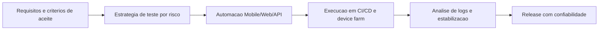

# Uriel Sampaio

### QA Automation Engineer | Mobile, Web, API | CI/CD

`Jandira - SP, Brasil` • `+4 anos em QA` • `Disponivel para desafios em Quality Engineering`

---

## Engenharia de Qualidade com ownership real

Atuo como **QA Automation Engineer** com mais de **4 anos** em produtos digitais, sendo responsavel por garantir a qualidade de aplicacoes **Mobile (Android/iOS)**, **Web** e **APIs** em contexto agil.

Hoje sou **QA unico no squad**, liderando a estrategia de testes ponta a ponta:

- analise de requisitos e mapeamento de riscos
- desenho da estrategia de testes por impacto de negocio
- automacao e execucao manual em fluxos criticos
- validacao final para release com foco em confiabilidade

Trabalho lado a lado com **Desenvolvedores, Product Owner e Scrum Master**, aplicando **Shift-Left Testing** na pratica para antecipar riscos e aumentar previsibilidade de entrega.

---

## Tech Stack de alto impacto

### Frameworks e ferramentas principais

  
  
  
  
  
  
  
  
  
  
  
  

### Core stack

`Appium` `CodeceptJS` `BDD (Gherkin)` `POM` `Playwright` `Cypress` `Postman` `Swagger` `LambdaTest` `GitHub Actions` `Azure Pipelines` `Jira` `Testomatio`

---

## O que eu faco no dia a dia

```mermaid
flowchart LR
    A[Requisitos e criterios de aceite] --> B[Estrategia de teste por risco]
    B --> C[Automacao Mobile/Web/API]
    C --> D[Execucao em CI/CD e device farm]
    D --> E[Analise de logs e estabilizacao]
    E --> F[Release com confiabilidade]
```

- **Automacao mobile cross-platform:** framework com Appium + CodeceptJS, BDD e POM, considerando comportamentos especificos de Android e iOS.
- **Confiabilidade de pipeline:** investigacao de falhas por logs, tratamento de flaky tests e ajuste de cenarios apos novas versoes da aplicacao.
- **Qualidade antes da producao:** testes manuais em homologacao para fluxos criticos de negocio.
- **Engenharia de risco:** atuacao ativa em refinamentos, estimativas e definicao de estrategia de teste com foco em prevencao.

---

## Destaques profissionais

| Area | Atuacao | Impacto |
|------|---------|---------|
| QA Strategy | QA unico no squad com ownership completo | Melhor decisao de qualidade e menor retrabalho |
| Mobile Automation | Framework Appium + CodeceptJS com BDD/POM | Maior cobertura e manutencao previsivel |
| CI/CD Reliability | Diagnostico de falhas e estabilizacao de suite | Menos ruido em pipeline e feedback mais confiavel |
| Shift-Left | Qualidade desde requisitos e refinamento | Risco reduzido antes da fase de validacao final |

---

## Projetos em destaque

| Projeto | Stack | Diferencial |
|--------|-------|-------------|
| [E2E Code Brokers](https://github.com/urielqa/E2E-Code-Brokers) | HTML, CSS, JavaScript, TradingView | Automacao E2E para fluxos de trading |
| [E2E Shop](https://github.com/urielqa/E2EShop) | HTML, CSS, JavaScript | Jornada completa de e-commerce (navegacao, carrinho, checkout) |
| [QA Automation Portfolio](https://github.com/urielqa/qa-automation-portfolio) | Cypress, Playwright, API, CI/CD | Framework orientado a boas praticas de automacao |
| [CodeceptJS + Playwright](https://github.com/urielqa/codeceptjs-playwright) | CodeceptJS, Playwright, BDD, Allure | POM + BDD + pipeline para execucao continua |
| [Casos de Teste Manuais](https://github.com/urielqa/Casos-de-teste-manuais) | Gherkin, BDD, Checklist | Base de cenarios para validacao manual e automacao |

---

## GitHub Analytics

---

## Mentalidade de Qualidade

> "Qualidade nao e apenas testar funcionalidades. E engenharia de confiabilidade, estrategia de risco e responsabilidade direta sobre a entrega."

---

## Vamos conectar

**Email:** `urielsqa@gmail.com`  
**WhatsApp:** `+55 11 94701-3629`  
**Localizacao:** `Itapevi - SP, Brasil`

# Uriel Sampaio

### QA Automation Engineer | Mobile, Web, API | CI/CD

`Jandira - SP, Brasil` • `+4 anos em QA`

---

## Sobre mim

Atuo como **QA Automation Engineer** com mais de **4 anos de experiencia** em produtos digitais, garantindo qualidade de aplicacoes **Mobile (Android/iOS)**, **Web** e **APIs** em times ageis.

Hoje, atuo como **QA unico em squad**, conduzindo a estrategia de testes ponta a ponta: da analise de requisitos a validacao final das entregas, trabalhando em parceria com desenvolvedores, Product Owner e Scrum Master.

Tenho forte experiencia em:

- Automacao mobile cross-platform com **Appium + CodeceptJS**
- Estruturacao com **BDD (Gherkin)** e **Page Object Model (POM)**
- Manutencao e refatoracao de suites automatizadas
- Investigacao de falhas em **pipelines CI/CD** (logs, flaky tests, regressao apos novas versoes)
- Testes manuais em homologacao para validacao de fluxos criticos antes da producao

---

## Como eu gero valor em QA

- Defino estrategia de testes alinhada ao contexto do produto e ao risco
- Aplico **Shift-Left Testing** desde refinamento e criterios de aceite
- Estruturo automacao para feedback rapido e confiavel no CI/CD
- Atuo em estabilidade da suite, reduzindo ruido de falhas intermitentes
- Garanto cobertura funcional em Android, iOS, Web e API

---

## Stack principal

### Automacao e testes

`Appium` `CodeceptJS` `Playwright` `Cypress` `BDD` `Gherkin` `POM`

### API e qualidade

`Postman` `Swagger` `Testes REST` `Testes manuais` `Smoke` `Regressao` `Exploratorio`

### CI/CD e ecossistema

`GitHub Actions` `Azure Pipelines` `LambdaTest` `Jira` `Testomatio` `GitHub` `Bitbucket`

---

## Experiencia em detalhe

### QA unico no squad

- Ownership completo da qualidade do produto
- Priorizacao baseada em risco e impacto no usuario
- Comunicacao continua com desenvolvimento e produto

### Automacao mobile cross-platform

- Criacao e evolucao de frameworks com Appium + CodeceptJS
- Cenarios BDD em Gherkin e organizacao por Page Objects
- Tratamento de particularidades Android/iOS (locators, resources e comportamento por plataforma)

### Confiabilidade em CI/CD

- Analise de falhas por log e comportamento de execucao
- Correcao de testes flaky e quebras recorrentes
- Melhoria continua da estabilidade dos pipelines

---

## Projetos em destaque

| Projeto | Stack | Destaque |
|--------|-------|----------|
| [E2E Code Brokers](https://github.com/urielqa/E2E-Code-Brokers) | HTML, CSS, JS, TradingView | Automacao E2E para fluxos de trading |
| [E2E Shop](https://github.com/urielqa/E2EShop) | HTML, CSS, JavaScript | Suite E2E para jornada de e-commerce |
| [QA Automation Portfolio](https://github.com/urielqa/qa-automation-portfolio) | Cypress, Playwright, API, CI/CD | Framework web/API com boas praticas e pipeline |
| [CodeceptJS + Playwright](https://github.com/urielqa/codeceptjs-playwright) | CodeceptJS, Playwright, BDD, Allure | E2E com BDD, POM, relatorios e CI |
| [Casos de Teste Manuais](https://github.com/urielqa/Casos-de-teste-manuais) | Gherkin, Checklist, BDD | Documentacao de cenarios para execucao manual/automacao |

---

## Filosofia de qualidade

> Qualidade vai alem da execucao de testes: envolve engenharia, estrategia e responsabilidade direta sobre a entrega do produto.

---

## Contato

- **LinkedIn:** [uriel-sampaio-728184356](https://www.linkedin.com/in/uriel-sampaio-728184356/)
- **Email:** [urielsqa@gmail.com](mailto:urielsqa@gmail.com)
- **WhatsApp:** [+55 11 94701-3629](https://wa.me/5511947013629)
- **GitHub:** [@urielqa](https://github.com/urielqa)

---

Se voce busca alguem para elevar a qualidade do produto com estrategia e automacao, vamos conversar.

