<div align="center">

# 🚀 Uriel Sampaio

### Engenheiro de Qualidade de Software com foco em garantir qualidade contínua e automação inteligente de ponta a ponta

[](https://www.linkedin.com/in/uriel-sampaio-728184356/)
[](https://github.com/urielqa)
[](mailto:urielsqa@gmail.com)
[](https://wa.me/5511947013629)

---

📍 **Itapevi - SP** | 🎯 **Foco em Testes Manuais e Automatizados | Qualidade e Eficiência**

</div>

---

## 👨‍💻 Sobre Mim

```mermaid
graph LR
    A[🎯 QA Engineer] --> B[🔧 Automação]
    A --> C[🧪 Testes Manuais]
    A --> D[🤖 IA Generativa]
    B --> E[📊 Qualidade Contínua]
    C --> E
    D --> E
```

<div align="center">



</div>

Sou **Engenheiro de Qualidade de Software** apaixonado por tecnologia desde os 14 anos. Com experiência sólida em **testes manuais e automatizados**, atuo em todas as etapas do ciclo de desenvolvimento (SDLC).  
Tenho como propósito garantir a **excelência e confiabilidade de produtos digitais** através de automação inteligente, análise técnica e mentalidade de melhoria contínua.

> **💡 Meu diferencial**: Background empreendedor com postura proativa e foco em entregar soluções funcionais e seguras para o cliente final.

Especializado em **Cypress**, **Playwright**, **Selenium** e **BDD (Cucumber)**, com domínio de **testes de API (Postman, RestAssured)** e **integração contínua (GitHub Actions, Jenkins, Docker)**.  
Adoto uma abordagem **Shift-Left**, contribuindo com o time desde a concepção da feature até a entrega em produção, sempre com foco em **liderança técnica** e **qualidade contínua**.

---

## 🎯 Principais Competências

<div align="center">

| 🔧 **Automação** | 🧪 **Testes** | 🚀 **DevOps** | 🤖 **IA** |
|------------------|---------------|---------------|-----------|
| ✅ E2E, Regressão | ✅ Exploratório, Smoke | ✅ CI/CD, Docker | ✅ LLMs, Cenários |
| ✅ BDD & Gherkin | ✅ API Testing | ✅ GitHub Actions | ✅ Scripts IA |
| ✅ Cypress, Playwright | ✅ Postman, RestAssured | ✅ Jenkins, Azure | ✅ Documentação |

</div>

---

## 🎯 Minha Missão como QA

<div align="center">

```diff
+ 🎯 MISSÃO: Garantir confiança e qualidade para o usuário final
+ ⚡ FOCO: Eficiência técnica + Impacto real no cliente  
+ 🚀 APLICAÇÃO: Liderança técnica + Qualidade contínua
```

> *"Minha missão como QA é garantir que o sistema entregue gere **confiança e qualidade** para o usuário final. Busco sempre o equilíbrio entre **eficiência técnica** e **impacto real no cliente**, aplicando **liderança técnica** e **qualidade contínua** em todos os projetos."*

</div>

---

## 🛠️ Habilidades Técnicas

| **Categoria** | **Habilidades** |
|---------------|-----------------|
| **🔧 Automação & Frameworks** | Cypress, Playwright, Selenium, Cucumber (Gherkin), TestNG, JUnit, RestAssured |
| **💻 Linguagens** | Java, JavaScript, TypeScript, HTML5, CSS3, SQL, C#, Python |
| **🧩 APIs & Backend** | REST, Postman, Swagger, Node.js, Spring Boot, Express |
| **🗄️ Banco de Dados** | MySQL, PostgreSQL, MongoDB, SQL Server, Redis |
| **🚀 CI/CD & DevOps** | Git, GitHub Actions, Jenkins, Docker, Azure DevOps |
| **📋 Gestão & Versionamento** | Qase, Jira, Zephyr, TestRail, Xray, Git Flow |
| **⚙️ Ferramentas de Desenvolvimento** | VS Code, Cursor, Eclipse, IntelliJ IDEA, Maven, npm, Yarn |

---

## 🎯 Principais Stacks

<p align="left">
  
  
  
  
  
  
  
  
  
  
  
  
</p>

---

## 🏆 Principais Conquistas

<div align="center">

| 🥇 **Conquista** | 📊 **Métrica** | 💡 **Impacto** |
|------------------|---------------|----------------|
| 🚀 **+50 Testes Automatizados** | `30%` redução | Tempo de regressão otimizado |
| 🎯 **BDD em Projetos Ágeis** | `100%` clareza | Comunicação QA-Dev-PO |
| ⚙️ **Pipeline CI/CD** | `24/7` execução | Feedback contínuo |
| 🌐 **Multiplataforma** | `3` ambientes | Cobertura completa |
| 🤖 **IA em QA** | `40%` economia | Automação inteligente |

</div>

---

## 🚀 Projetos em Destaque

<div align="center">

| 🎯 **Projeto** | 🛠️ **Stack** | 🚀 **Destaque** |
|----------------|--------------|-----------------|
| [**💼 E2E Code Brokers**](https://github.com/urielqa/E2E-Code-Brokers) | `HTML5` `CSS3` `JS` `TradingView` | Plataforma de trading com validações B3 |
| [**🛒 E2E Shop**](https://github.com/urielqa/E2EShop) | `HTML` `CSS` `JavaScript` | E-commerce completo em squad |
| [**🚀 QA Automation Portfolio**](https://github.com/urielqa/qa-automation-portfolio) | `Cypress` `Playwright` `API` `CI/CD` | **Showcase principal** com pipeline |
| [**📋 Casos de Teste Manuais**](https://github.com/urielqa/Casos-de-teste-manuais) | `Gherkin` `BDD` `Checklist` | Documentação QA profissional |

### 🔧 **Projetos Complementares**

| 🎯 **Projeto** | 🛠️ **Stack** | 🚀 **Foco** |
|----------------|--------------|-------------|
| [**🔧 Automação de Testes**](https://github.com/urielqa/Automacao-de-testes) | `Selenium` `JUnit` `Java` | **Automação Java** e exemplos clássicos |

</div>

### 🔥 **Highlights dos Projetos**

```diff
+ 💼 E2E Code Brokers: Trading platform com validações B3 e QA Ready
+ 🛒 E2E Shop: E-commerce desenvolvido em squad com foco em qualidade  
+ 🚀 QA Portfolio: Showcase PRINCIPAL com Cypress, Playwright, API Testing e CI/CD
+ 📋 Casos Manuais: Gherkin, BDD, Checklist para colaboração QA-Dev-PO
+ 🔧 Automação Java: Exemplos complementares com Selenium e JUnit
```

---

## 🧠 Experiência com IA Generativa

<div align="center">


</div>

| 🎯 **Aplicação** | 📊 **Métrica** | 🚀 **Resultado** |
|------------------|---------------|------------------|
| **📝 Geração de Cenários** | `40%` economia | Scripts Playwright otimizados |
| **⚡ Automação Assistida** | `LLMs` integrados | Cypress + Playwright |
| **🔍 Análise Inteligente** | `Copilot` ativo | Identificação de falhas |
| **📊 Documentação Auto** | `100%` cobertura | Processos e relatórios |  

---

## 🎓 Formação

- 🎓 **E2E Treinamentos** – Desenvolvimento e Qualidade de Software *(2025–2026)*  
- 🎓 **UNIP** – Gestão da Tecnologia da Informação *(2018–2020)*  
- 🎓 **UNIBES** – Web Design *(2015)*  

---

## 🧩 Soft Skills

| 💬 Comunicação | 👑 Visão de Dono | ⚡ Proatividade |
|----------------|----------------|----------------|
| Clareza entre QA, Dev e PO | Propõe melhorias e processos | Atua de forma antecipada |
| 🤝 Colaboração | 🔧 Resolução de Problemas | 🚀 Inovação |
| Trabalha bem em squads ágeis | Abordagem analítica | Busca constante por evolução |

---

## 📈 Estatísticas do GitHub

<div align="center">


</div>

---

## 🎯 Objetivos Profissionais

- 🚀 Ampliar expertise em **automação e qualidade contínua**  
- 🤖 Aplicar **IA Generativa** em estratégias de QA  
- 🧩 Contribuir com **projetos open-source** e comunidades de teste  
- 🧪 Liderar **iniciativas de qualidade** em times ágeis

---

## 📞 Vamos Conectar?

<div align="center">

```diff
+ 🚀 Pronto para colaborar em projetos de qualidade!
+ 💡 Vamos discutir automação, testes e inovação em QA
+ 🤝 Conecte-se e vamos criar algo incrível juntos
```

[](https://www.linkedin.com/in/uriel-sampaio-728184356/)
[](mailto:urielsqa@gmail.com)
[](https://wa.me/5511947013629)

---

**📧 Email**: `urielsqa@gmail.com`  
**📱 WhatsApp**: `+55 11 94701-3629`  
**📍 Localização**: `Itapevi - SP, Brasil`

---

### ⭐ "Qualidade não é acidente — é o resultado de esforço inteligente." ⭐ 

<div align="center">

**Feito com ❤️ por [Uriel Sampaio](https://github.com/urielqa)**


</div>
